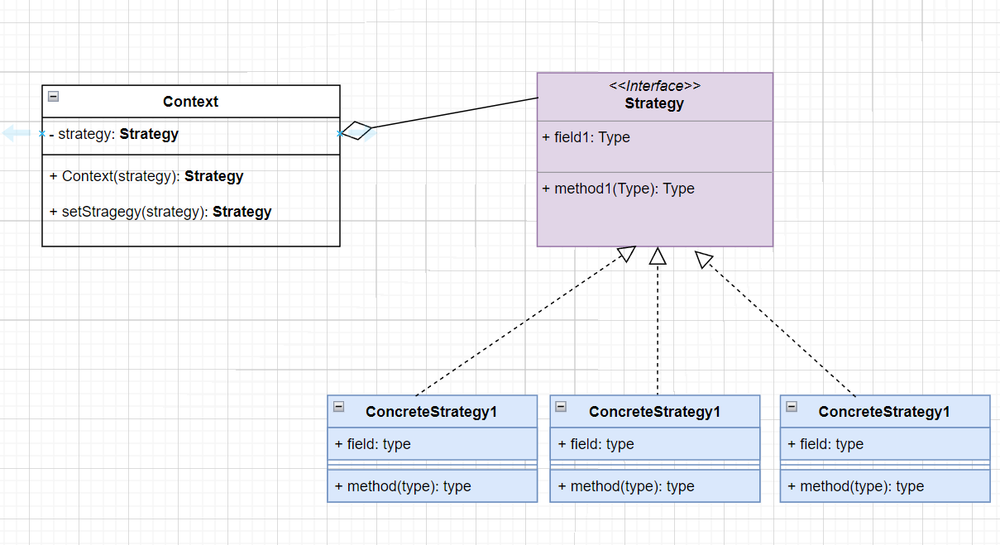
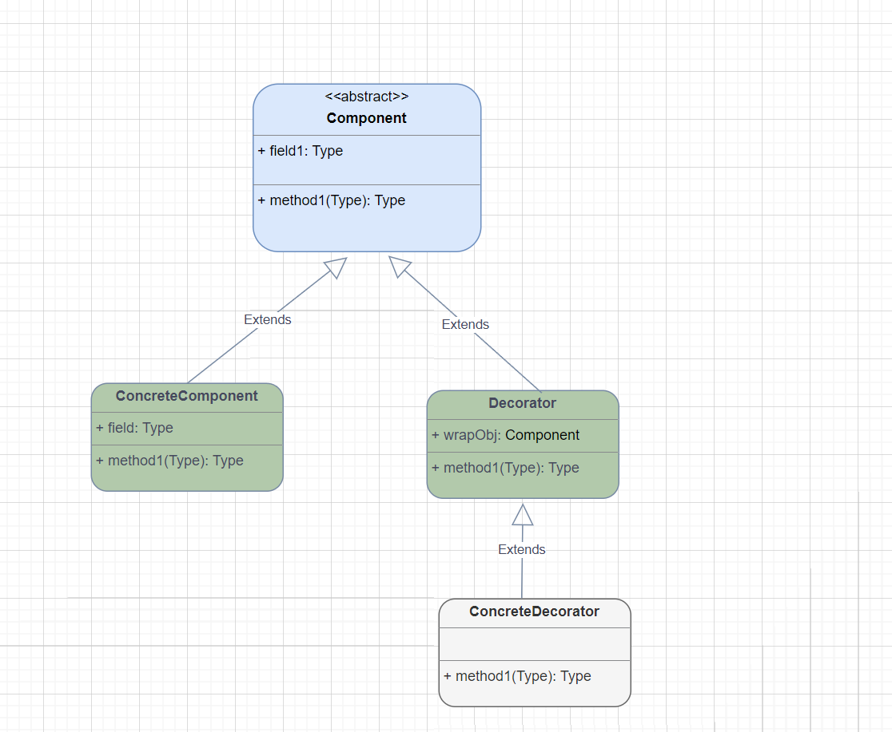

# 策略模式
## 主要角色
- 抽象策略（Strategy）类：这是一个抽象角色，通常由一个接口或抽象类实现。此角色给出所有
的具体策略类所需的接口。
- 具体策略（Concrete Strategy）类：实现了抽象策略定义的接口，提供具体的算法实现或行
为。
- 环境（Context）类：持有一个策略类的引用，最终给客户端调
## 代码和类图
代码：com.byone421.strategy

类图源文件：resources/drawio/策略模式.drawio

# 装饰者模式
## 主要角色
- 抽象构件（Component）角色 ：定义一个抽象接口以规范准备接收附加责任的对象。
- 具体构件（Concrete Component）角色 ：实现抽象构件，通过装饰角色为其添加一些职责。
- 抽象装饰（Decorator）角色 ： 继承或实现抽象构件，并包含具体构件的实例，可以通过其子
类扩展具体构件的功能。
- 具体装饰（ConcreteDecorator）角色 ：实现抽象装饰的相关方法，并给具体构件对象添加附
加的责任。
## 代码和类图
代码：com.byone421.decorator

类图源文件：resources/drawio/装饰者模式.drawio

