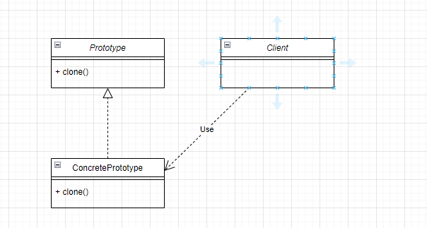
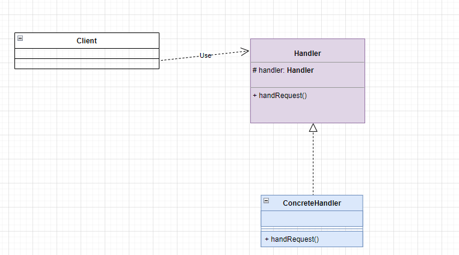
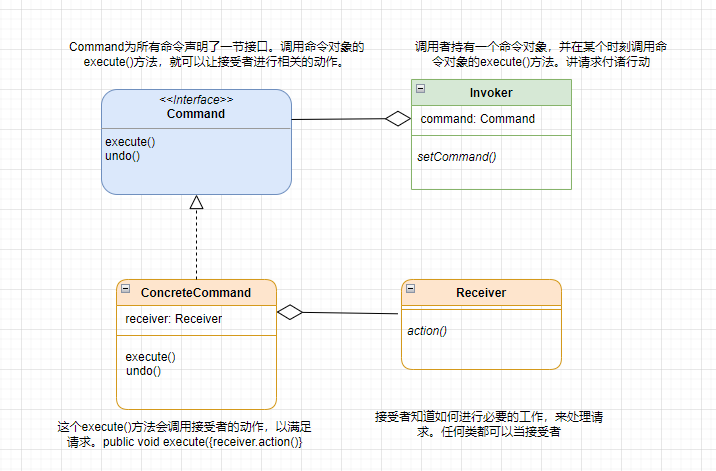
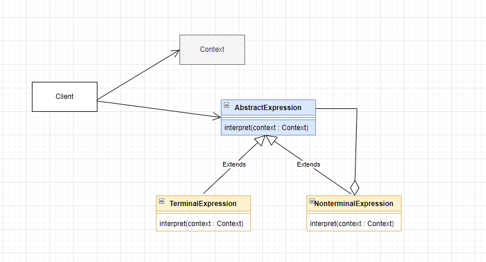
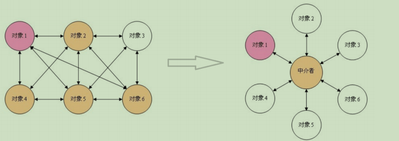
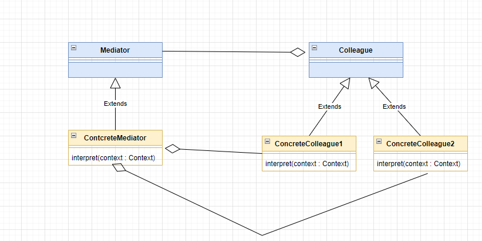
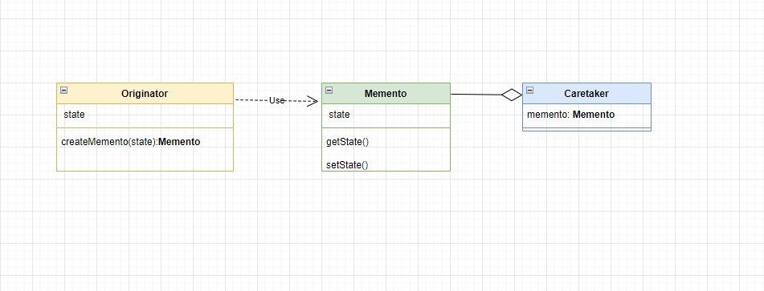
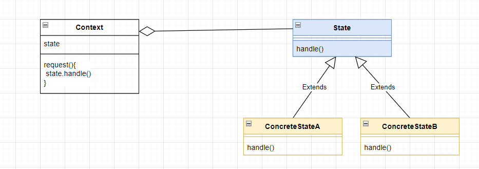
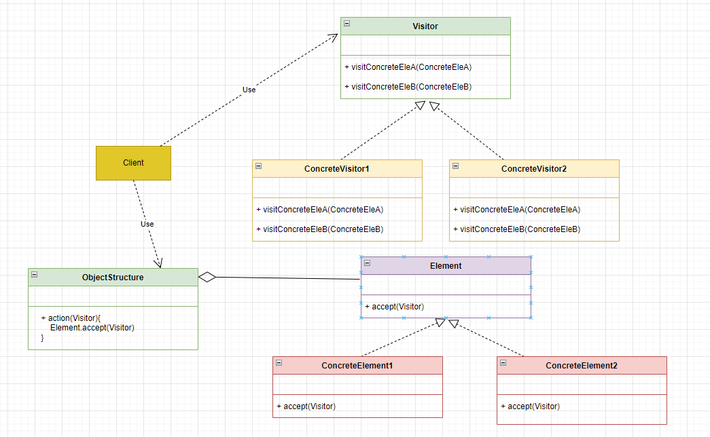

设计模式的核心在于提供了相关问题的解决方案，使得人们可以更加简单方便地**复用成功的设计和体系结构**。其分类如下：

# 一、创建型模式
用于描述“怎样创建对象”，它的主要特点是“将对象的创建与使用分离
创建型模式分为：单例、原型、工厂方法、抽象工厂、建造者等 5 种模式

## 单例模式

详细请看：resources/md/单件模式.md

## 原型模式
用一个已经创建的实例作为原型，通过复制该原型对象来创建一个和原型对象相同的新对象。

### 主要角色
- 抽象原型类：规定了具体原型对象必须实现的的 clone() 方法。
- 具体原型类：实现抽象原型类的 clone() 方法，它是可被复制的对象。
- 访问类：使用具体原型类中的 clone() 方法来复制新的对象。
  

### 代码和类图文件
代码：com.byone421.prototype

类图源文件：resources/drawio/原型模式.drawio

## 工厂模式
### 简单工厂
简单工厂不是一种设计模式，反而比较像是一种编程习惯。
#### 主要角色
- 抽象产品 ：定义了产品的规范，描述了产品的主要特性和功能。
- 具体产品 ：实现或者继承抽象产品的子类
- 具体工厂 ：提供了创建产品的方法，调用者通过该方法来获取产品。

  

### 工厂方法
定义一个用于创建对象的接口，让子类决定实例化哪个产品类对象。工厂方法使一个产品类的实例化延
迟到其工厂的子类。
#### 主要角色
- 抽象工厂（Abstract Factory）：提供了创建产品的接口，调用者通过它访问具体工厂的工厂
  方法来创建产品。
- 具体工厂（ConcreteFactory）：主要是实现抽象工厂中的抽象方法，完成具体产品的创建。
- 抽象产品（Product）：定义了产品的规范，描述了产品的主要特性和功能。
- 具体产品（ConcreteProduct）：实现了抽象产品角色所定义的接口，由具体工厂来创建，它同
  具体工厂之间一一对应。

#### 抽象工厂
是一种为访问类提供一个创建一组相关或相互依赖对象的接口，且访问类无须指定所要产品的具体类就
能得到同族的不同等级的产品的模式结构。
抽象工厂模式是工厂方法模式的升级版本，工厂方法模式只生产一个等级的产品，而抽象工厂模式可生
产多个等级的产品。

#### 主要角色
- 抽象工厂（Abstract Factory）：提供了创建产品的接口，它包含多个创建产品的方法，可以
  创建多个不同等级的产品。
- 具体工厂（Concrete Factory）：主要是实现抽象工厂中的多个抽象方法，完成具体产品的创
  建。
- 抽象产品（Product）：定义了产品的规范，描述了产品的主要特性和功能，抽象工厂模式有多
  个抽象产品。
- 具体产品（ConcreteProduct）：实现了抽象产品角色所定义的接口，由具体工厂来创建，它
  同具体工厂之间是多对一的关系。
  
  
### 代码和类图文件
代码：com.byone421.factory

类图源文件：resources/drawio/工厂模式.drawio

## 建造者模式
将一个复杂对象的构建与表示分离，使得同样的构建过程可以创建不同的表示
### 主要角色
- 抽象建造者类（Builder）：这个接口规定要实现复杂对象的那些部分的创建，并不涉及具体的
部件对象的创建。
- 具体建造者类（ConcreteBuilder）：实现 Builder 接口，完成复杂产品的各个部件的具体
创建方法。在构造过程完成后，提供产品的实例。
- 产品类（Product）：要创建的复杂对象。
- 指挥者类（Director）：调用具体建造者来创建复杂对象的各个部分，在指导者中不涉及具体产
品的信息，只负责保证对象各部分完整创建或按某种顺序创建。

# 二、结构型模式
用于描述如何将类或对象按某种布局组成更大的结构，
结构型模式分为：代理、适配器、 桥接、装饰、外观、享元、组合等 7 种模式

## 装饰者模式
旨在不改变现有对象结构的情况下，动态地给该对象增加一些职责（即增加其额外功能）的模式。
### 主要角色
- 抽象构件（Component）角色 ：定义一个抽象接口以规范准备接收附加责任的对象。
- 具体构件（Concrete Component）角色 ：实现抽象构件，通过装饰角色为其添加一些职责。
- 抽象装饰（Decorator）角色 ： 继承或实现抽象构件，并包含具体构件的实例，可以通过其子
  类扩展具体构件的功能。
- 具体装饰（ConcreteDecorator）角色 ：实现抽象装饰的相关方法，并给具体构件对象添加附
  加的责任。

  

### 代码和类图文件
代码：com.byone421.decorator

类图源文件：resources/drawio/装饰者模式.drawio

## 适配器模式
将一个类的接口转换成客户希望的另外一个接口，使得原本由于接口不兼容而不能一起工作的那些类能 一起工作。
适配器模式分为类适配器模式和对象适配器模式，前者类之间的耦合度比后者高，且要求程序员了解现 有组件库中的相关组件的内部结构，所以应用相对较少些

### 主要角色
- 目标（Target）接口：当前系统业务所期待的接口，它可以是抽象类或接口。
- 适配者（Adaptee）类：它是被访问和适配的现存组件库中的组件接口。
  -适配器（Adapter）类：它是一个转换器，通过继承或引用适配者的对象，把适配者接口转换成 目标接口，让客户按目标接口的格式访问适配者。
  
### 代码和类图文件
代码：com.byone421.adapter

类图源文件：resources/drawio/适配器模式.drawio

## 代理模式
由于某些原因需要给某对象提供一个代理以控制对该对象的访问。这时，访问对象不适合或者不能直接
引用目标对象，代理对象作为访问对象和目标对象之间的中介。
Java中的代理按照代理类生成时机不同又分为静态代理和动态代理。静态代理代理类在编译期就生
成，而动态代理代理类则是在Java运行时动态生成。动态代理又有JDK代理和CGLib代理两种。

### 主要角色
- 抽象主题（Subject）类： 通过接口或抽象类声明真实主题和代理对象实现的业务方法。
- 真实主题（Real Subject）类： 实现了抽象主题中的具体业务，是代理对象所代表的真实对
  象，是最终要引用的对象。
- 代理（Proxy）类 ： 提供了与真实主题相同的接口，其内部含有对真实主题的引用，它可以访
  问、控制或扩展真实主题的功能
  

### 代码和类图文件
代码：com.byone421.proxy

类图源文件：resources/drawio/代理模式.drawio

# 三、行为型模式
用于描述类或对象之间怎样相互协作共同完成单个对象无法单独完成的任务，以及怎样分配职责。
创建型模式分为：模板方法、策略、命令、责任链、状态、观察者、中介者、迭代器、访问者、备忘录、解释器等 11 种模式。

## 策略模式
该模式定义了一系列算法，并将每个算法封装起来，使它们可以相互替换，且算法的变化不会影响使用
算法的客户。策略模式属于对象行为模式，它通过对算法进行封装，把使用算法的责任和算法的实现分
割开来，并委派给不同的对象对这些算法进行管理。
### 主要角色
- 抽象策略（Strategy）类：这是一个抽象角色，通常由一个接口或抽象类实现。此角色给出所有
  的具体策略类所需的接口。
- 具体策略（Concrete Strategy）类：实现了抽象策略定义的接口，提供具体的算法实现或行
  为。
- 环境（Context）类：持有一个策略类的引用，最终给客户端调

  

### 代码和类图文件
代码：com.byone421.strategy

类图源文件：resources/drawio/策略模式.drawio

## 模板方法模式
定义一个操作中的算法骨架，而将算法的一些步骤延迟到子类中，使得子类可以不改变该算法结构的情
况下重定义该算法的某些特定步骤。

### 主要角色
* 抽象类（Abstract Class）：负责给出一个算法的轮廓和骨架。它由一个模板方法和若干个基本方法构成。

  * 模板方法：定义了算法的骨架，按某种顺序调用其包含的基本方法。

  * 基本方法：是实现算法各个步骤的方法，是模板方法的组成部分。基本方法又可以分为三种：

    * 抽象方法(Abstract Method) ：一个抽象方法由抽象类声明、由其具体子类实现。

    * 具体方法(Concrete Method) ：一个具体方法由一个抽象类或具体类声明并实现，其子类可以进行覆盖也可以直接继承。

    * 钩子方法(Hook Method) ：在抽象类中已经实现，包括用于判断的逻辑方法和需要子类重写的空方法两种。

      一般钩子方法是用于判断的逻辑方法，这类方法名一般为isXxx，返回值类型为boolean类型。

* 具体子类（Concrete Class）：实现抽象类中所定义的抽象方法和钩子方法，它们是一个顶级逻辑的组成步骤。

### 代码和类图文件
代码：com.byone421.templatemethod

类图源文件：resources/drawio/模板方法.drawio

## 观察者模式
又被称为发布-订阅（Publish/Subscribe）模式，它定义了一种一对多的依赖关系，让多个观察者
对象同时监听某一个主题对象。这个主题对象在状态变化时，会通知所有的观察者对象，使他们能够自
动更新自己

### 主要角色：
- Subject：抽象主题（抽象被观察者），抽象主题角色把所有观察者对象保存在一个集合里，每
  个主题都可以有任意数量的观察者，抽象主题提供一个接口，可以增加和删除观察者对象。
- ConcreteSubject：具体主题（具体被观察者），该角色将有关状态存入具体观察者对象，在具
  体主题的内部状态发生改变时，给所有注册过的观察者发送通知。
- Observer：抽象观察者，是观察者的抽象类，它定义了一个更新接口，使得在得到主题更改通知
  时更新自己。
- ConcreteObserver：具体观察者，实现抽象观察者定义的更新接口，以便在得到主题更改通知
  时更新自身的状态。
  
### 代码和类图文件
代码：com.byone421.observer

类图源文件：resources/drawio/观察者模式.drawio

## 迭代器模式
提供一个对象来顺序访问聚合对象中的一系列数据，而不暴露聚合对象的内部表示。
### 主要角色
- 抽象聚合（Aggregate）角色：定义存储、添加、删除聚合元素以及创建迭代器对象的接口。
- 具体聚合（ConcreteAggregate）角色：实现抽象聚合类，返回一个具体迭代器的实例。
- 抽象迭代器（Iterator）角色：定义访问和遍历聚合元素的接口，通常包含 hasNext()、 next() 等方法。
- 具体迭代器（ConcreteIterator）角色：实现抽象迭代器接口中所定义的方法，完成对聚合对象的遍历，记录遍历的当前位置。

  

### 代码和类图文件
代码：com.byone421.iterator

类图源文件：resources/drawio/迭代器模式.drawio

## 责任链模式
又名职责链模式，为了避免请求发送者与多个请求处理者耦合在一起，将所有请求的处理者通过前一对
象记住其下一个对象的引用而连成一条链；当有请求发生时，可将请求沿着这条链传递，直到有对象处
理它为止。

### 主要角色
- 抽象处理者（Handler）角色：定义一个处理请求的接口，包含抽象处理方法和一个后继连接。
- 具体处理者（Concrete Handler）角色：实现抽象处理者的处理方法，判断能否处理本次请
  求，如果可以处理请求则处理，否则将该请求转给它的后继者。
- 客户类（Client）角色：创建处理链，并向链头的具体处理者对象提交请求，它不关心处理细节
  和请求的传递过程。
  
### 代码和类图文件
代码：com.byone421.responsibility

类图源文件：resources/drawio/责任链模式.drawio

## 命令模式
将一个请求封装为一个对象，使发出请求的责任和执行请求的责任分割开。这样两者之间通过命令对象进行沟通，这样方便将命令对象进行存储、传递、调用、增加与管理。

### 主要角色
- 抽象命令类(Command)角色: 定义命令的接口，声明执行的方法。
- 具体命令(ConcreteCommand)角色:具体的命令，实现命令接口;通常会持有接收者，并调用接收者的功能来完成命令要执行的操作。
- 实现者/接收者(Receiver)角色: 接收者，真正执行命令的对象。任何类都可能成为一个接收者，只要它能够实现命令要求实现的相应功能。
- 调用者/请求者(Invoker)角色: 要求命令对象执行请求，通常会持有命令对象，可以持有很多的命令对象。这个是客户端真正触发命令并要求命令执行相应操作的地方，也就是说相当于使用命令对象的入口。
  
### 代码和类图文件

代码：com.byone421.command

类图源文件： resources/drawio/命令模式.drawio

## 解释器模式
给定一个语言，定义它的文法表示，并定义一个解释器，这个解释器使用该标识来解释语言中的句子。
### 主要角色
- 抽象表达式(Abstract Expression)角色:定义解释器的接口，约定解释器的解释操作，主要包含解释方法 interpret()。
- 终结符表达式(Terminal Expression)角色:是抽象表达式的子类，用来实现文法中与终结符相关的操作，文法中的每一个终结符都有一个具体终结表达式与之相对应。
- 非终结符表达式(Nonterminal Expression)角色:也是抽象表达式的子类，用来实现文法中与非终结符相关的操作，文法中的每条规则都对应于一个非终结符表达式。
- 环境(context)角色:通常包含各个解释器需要的数据或是公共的功能，一般用来传递被所有解释器共享的数据，后面的解释器可以从这里获取这些值。
- 客户端(client):主要任务是将需要分析的句子或表达式转换成使用解释器对象描述的抽象语法树，然后调用解释器的解释方法，当然也可以通过环境角色间接访问解释器的解释方法。

### 代码和类图文件

代码：com.byone421.interpreter

类图源文件： resources/drawio/解释器模式.drawio

## 中介者模式
又叫调停模式，定义一个中介角色来封装一系列对象之间的交互，使原有对象之间的耦合松散，且可以独立地改变它们之间的交互。

### 主要角色
* 抽象中介者（Mediator）角色：它是中介者的接口，提供了同事对象注册与转发同事对象信息的抽象方法。
* 具体中介者（ConcreteMediator）角色：实现中介者接口，定义一个 List 来管理同事对象，协调各个同事角色之间的交互关系，因此它依赖于同事角色。
* 抽象同事类（Colleague）角色：定义同事类的接口，保存中介者对象，提供同事对象交互的抽象方法，实现所有相互影响的同事类的公共功能。
* 具体同事类（Concrete Colleague）角色：是抽象同事类的实现者，当需要与其他同事对象交互时，由中介者对象负责后续的交互。

### 代码和类图文件

代码：com.byone421.mediator

类图源文件： resources/drawio/中介者模式.drawio

## 备忘录模式
又叫快照模式，在不破坏封装性的前提下，捕获一个对象的内部状态，并在该对象之外保存这个状态，以便以后当需要时能将该对象恢复到原先保存的状态。

### 主要角色
* 发起人（Originator）角色：记录当前时刻的内部状态信息，提供创建备忘录和恢复备忘录数据的功能，实现其他业务功能，它可以访问备忘录里的所有信息。
* 备忘录（Memento）角色：负责存储发起人的内部状态，在需要的时候提供这些内部状态给发起人。
* 管理者（Caretaker）角色：对备忘录进行管理，提供保存与获取备忘录的功能，但其不能对备忘录的内容进行访问与修改。

> 备忘录有两个等效的接口：
>
> * **窄接口**：管理者(Caretaker)对象（和其他发起人对象之外的任何对象）看到的是备忘录的窄接口(narrow Interface)，这个窄接口只允许他把备忘录对象传给其他的对象。
> * **宽接口**：与管理者看到的窄接口相反，发起人对象可以看到一个宽接口(wide Interface)，这个宽接口允许它读取所有的数据，以便根据这些数据恢复这个发起人对象的内部状态。

### 代码和类图文件

代码：com.byone421.memento

类图源文件： resources/drawio/备忘录模式.drawio

## 状态模式
对有状态的对象，把复杂的“判断逻辑”提取到不同的状态对象中，允许状态对象在其内部状态发生改变时改变其行为。
### 主要角色
* 环境（Context）角色：也称为上下文，它定义了客户程序需要的接口，维护一个当前状态，并将与状态相关的操作委托给当前状态对象来处理。
* 抽象状态（State）角色：定义一个接口，用以封装环境对象中的特定状态所对应的行为。
* 具体状态（Concrete  State）角色：实现抽象状态所对应的行为。

### 代码和类图文件

代码：com.byone421.state

类图源文件： resources/drawio/状态模式.drawio

## 访问者模式
封装一些作用于某种数据结构中的各元素的操作，它可以在不改变这个数据结构的前提下定义作用于这些元素的新的操作。

### 主要角色
* 抽象访问者（Visitor）角色：定义了对每一个元素`（Element）`访问的行为，它的参数就是可以访问的元素，它的方法个数理论上来讲与元素类个数（Element的实现类个数）是一样的，从这点不难看出，访问者模式要求元素类的个数不能改变。
* 具体访问者（ConcreteVisitor）角色：给出对每一个元素类访问时所产生的具体行为。
* 抽象元素（Element）角色：定义了一个接受访问者的方法（`accept`），其意义是指，每一个元素都要可以被访问者访问。
* 具体元素（ConcreteElement）角色： 提供接受访问方法的具体实现，而这个具体的实现，通常情况下是使用访问者提供的访问该元素类的方法。
* 对象结构（Object Structure）角色：定义当中所提到的对象结构，对象结构是一个抽象表述，具体点可以理解为一个具有容器性质或者复合对象特性的类，它会含有一组元素（`Element`），并且可以迭代这些元素，供访问者访问。
### 代码和类图文件

代码：com.byone421.visitor

类图源文件： resources/drawio/访问者模式.drawio

