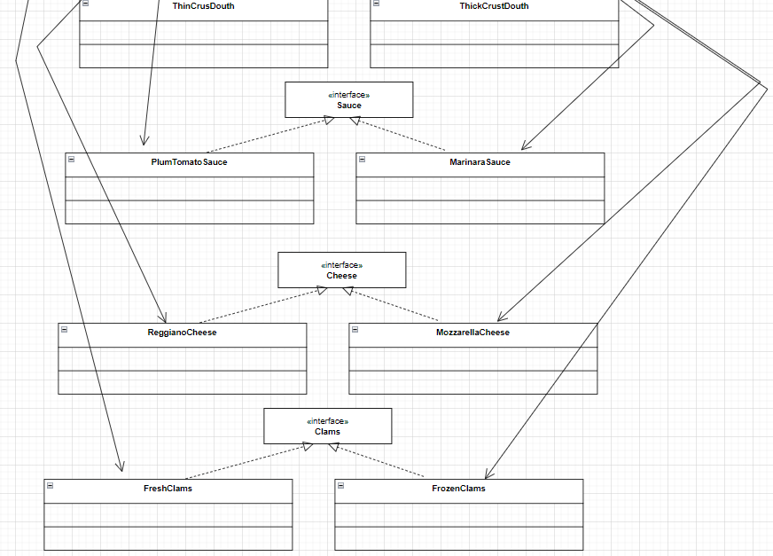

# 策略模式
该模式定义了一系列算法，并将每个算法封装起来，使它们可以相互替换，且算法的变化不会影响使用
算法的客户。策略模式属于对象行为模式，它通过对算法进行封装，把使用算法的责任和算法的实现分
割开来，并委派给不同的对象对这些算法进行管理。
## 主要角色
- 抽象策略（Strategy）类：这是一个抽象角色，通常由一个接口或抽象类实现。此角色给出所有
的具体策略类所需的接口。
- 具体策略（Concrete Strategy）类：实现了抽象策略定义的接口，提供具体的算法实现或行
为。
- 环境（Context）类：持有一个策略类的引用，最终给客户端调
 
  

## 代码和类图文件
代码：com.byone421.strategy

类图源文件：resources/drawio/策略模式.drawio

# 装饰者模式
旨在不改变现有对象结构的情况下，动态地给该对象增加一些职责（即增加其额外功能）的模式。
## 主要角色
- 抽象构件（Component）角色 ：定义一个抽象接口以规范准备接收附加责任的对象。
- 具体构件（Concrete Component）角色 ：实现抽象构件，通过装饰角色为其添加一些职责。
- 抽象装饰（Decorator）角色 ： 继承或实现抽象构件，并包含具体构件的实例，可以通过其子
类扩展具体构件的功能。
- 具体装饰（ConcreteDecorator）角色 ：实现抽象装饰的相关方法，并给具体构件对象添加附
加的责任。 

  

## 代码和类图文件
代码：com.byone421.decorator

类图源文件：resources/drawio/装饰者模式.drawio

# 工厂模式
## 简单工厂
简单工厂不是一种设计模式，反而比较像是一种编程习惯。
### 主要角色
- 抽象产品 ：定义了产品的规范，描述了产品的主要特性和功能。
- 具体产品 ：实现或者继承抽象产品的子类
- 具体工厂 ：提供了创建产品的方法，调用者通过该方法来获取产品。

  

## 工厂方法 
定义一个用于创建对象的接口，让子类决定实例化哪个产品类对象。工厂方法使一个产品类的实例化延
迟到其工厂的子类。
### 主要角色
- 抽象工厂（Abstract Factory）：提供了创建产品的接口，调用者通过它访问具体工厂的工厂
方法来创建产品。
- 具体工厂（ConcreteFactory）：主要是实现抽象工厂中的抽象方法，完成具体产品的创建。
- 抽象产品（Product）：定义了产品的规范，描述了产品的主要特性和功能。
- 具体产品（ConcreteProduct）：实现了抽象产品角色所定义的接口，由具体工厂来创建，它同
具体工厂之间一一对应。

### 抽象工厂
是一种为访问类提供一个创建一组相关或相互依赖对象的接口，且访问类无须指定所要产品的具体类就
能得到同族的不同等级的产品的模式结构。
抽象工厂模式是工厂方法模式的升级版本，工厂方法模式只生产一个等级的产品，而抽象工厂模式可生
产多个等级的产品。

### 主要角色
- 抽象工厂（Abstract Factory）：提供了创建产品的接口，它包含多个创建产品的方法，可以
创建多个不同等级的产品。
- 具体工厂（Concrete Factory）：主要是实现抽象工厂中的多个抽象方法，完成具体产品的创
建。
- 抽象产品（Product）：定义了产品的规范，描述了产品的主要特性和功能，抽象工厂模式有多
个抽象产品。
- 具体产品（ConcreteProduct）：实现了抽象产品角色所定义的接口，由具体工厂来创建，它
同具体工厂之间是多对一的关系。

## 代码和类图文件
代码：com.byone421.factory

类图源文件：resources/drawio/工厂模式.drawio

# 模板方法模式
定义一个操作中的算法骨架，而将算法的一些步骤延迟到子类中，使得子类可以不改变该算法结构的情
况下重定义该算法的某些特定步骤。

## 主要角色
* 抽象类（Abstract Class）：负责给出一个算法的轮廓和骨架。它由一个模板方法和若干个基本方法构成。

  * 模板方法：定义了算法的骨架，按某种顺序调用其包含的基本方法。

  * 基本方法：是实现算法各个步骤的方法，是模板方法的组成部分。基本方法又可以分为三种：

    * 抽象方法(Abstract Method) ：一个抽象方法由抽象类声明、由其具体子类实现。

    * 具体方法(Concrete Method) ：一个具体方法由一个抽象类或具体类声明并实现，其子类可以进行覆盖也可以直接继承。

    * 钩子方法(Hook Method) ：在抽象类中已经实现，包括用于判断的逻辑方法和需要子类重写的空方法两种。

      一般钩子方法是用于判断的逻辑方法，这类方法名一般为isXxx，返回值类型为boolean类型。

* 具体子类（Concrete Class）：实现抽象类中所定义的抽象方法和钩子方法，它们是一个顶级逻辑的组成步骤。

## 代码和类图文件
代码：com.byone421.templatemethod

类图源文件：resources/drawio/模板方法.drawio

# 单例模式

详细请看：resources/md/单件模式.md

# 适配器模式
将一个类的接口转换成客户希望的另外一个接口，使得原本由于接口不兼容而不能一起工作的那些类能 一起工作。
适配器模式分为类适配器模式和对象适配器模式，前者类之间的耦合度比后者高，且要求程序员了解现 有组件库中的相关组件的内部结构，所以应用相对较少些

## 主要角色
- 目标（Target）接口：当前系统业务所期待的接口，它可以是抽象类或接口。
- 适配者（Adaptee）类：它是被访问和适配的现存组件库中的组件接口。
 -适配器（Adapter）类：它是一个转换器，通过继承或引用适配者的对象，把适配者接口转换成 目标接口，让客户按目标接口的格式访问适配者。

## 代码和类图文件
代码：com.byone421.adapter

类图源文件：resources/drawio/适配器模式.drawio

# 观察者模式
又被称为发布-订阅（Publish/Subscribe）模式，它定义了一种一对多的依赖关系，让多个观察者
对象同时监听某一个主题对象。这个主题对象在状态变化时，会通知所有的观察者对象，使他们能够自
动更新自己

# 主要角色：
- Subject：抽象主题（抽象被观察者），抽象主题角色把所有观察者对象保存在一个集合里，每
个主题都可以有任意数量的观察者，抽象主题提供一个接口，可以增加和删除观察者对象。
- ConcreteSubject：具体主题（具体被观察者），该角色将有关状态存入具体观察者对象，在具
体主题的内部状态发生改变时，给所有注册过的观察者发送通知。
- Observer：抽象观察者，是观察者的抽象类，它定义了一个更新接口，使得在得到主题更改通知
时更新自己。
- ConcreteObserver：具体观察者，实现抽象观察者定义的更新接口，以便在得到主题更改通知
时更新自身的状态。
  
## 代码和类图文件
代码：com.byone421.observer

类图源文件：resources/drawio/观察者模式.drawio

# 迭代器模式
提供一个对象来顺序访问聚合对象中的一系列数据，而不暴露聚合对象的内部表示。
## 主要角色
- 抽象聚合（Aggregate）角色：定义存储、添加、删除聚合元素以及创建迭代器对象的接口。
- 具体聚合（ConcreteAggregate）角色：实现抽象聚合类，返回一个具体迭代器的实例。
- 抽象迭代器（Iterator）角色：定义访问和遍历聚合元素的接口，通常包含 hasNext()、 next() 等方法。
- 具体迭代器（ConcreteIterator）角色：实现抽象迭代器接口中所定义的方法，完成对聚合对象的遍历，记录遍历的当前位置。

  

# 代理模式
由于某些原因需要给某对象提供一个代理以控制对该对象的访问。这时，访问对象不适合或者不能直接
引用目标对象，代理对象作为访问对象和目标对象之间的中介。
Java中的代理按照代理类生成时机不同又分为静态代理和动态代理。静态代理代理类在编译期就生
成，而动态代理代理类则是在Java运行时动态生成。动态代理又有JDK代理和CGLib代理两种。

## 主要角色
- 抽象主题（Subject）类： 通过接口或抽象类声明真实主题和代理对象实现的业务方法。
- 真实主题（Real Subject）类： 实现了抽象主题中的具体业务，是代理对象所代表的真实对
象，是最终要引用的对象。
- 代理（Proxy）类 ： 提供了与真实主题相同的接口，其内部含有对真实主题的引用，它可以访
问、控制或扩展真实主题的功能

## 代码和类图文件
代码：com.byone421.proxy

类图源文件：resources/drawio/代理模式.drawio